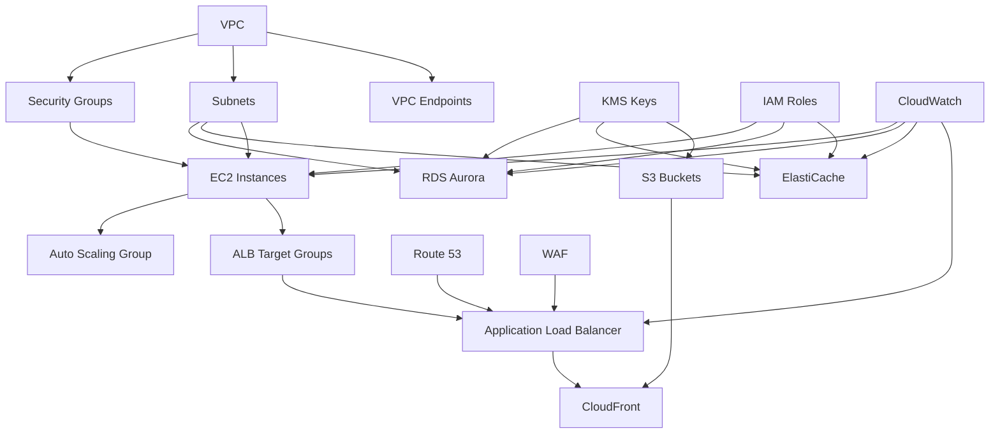

# Katya Cleaning Services - AWS Infrastructure

## Overview

This repository contains the complete AWS infrastructure as code for Katya Cleaning Services, built using Terragrunt and following enterprise-grade best practices. The infrastructure is designed for high availability, security, and scalability in the production environment.

## Architecture

## 🗺️ Resource Map

This project manages a comprehensive AWS infrastructure across **Development** and **Production** environments for Katya Cleaning Services:

### Core Infrastructure Overview

| Resource Category | AWS Services | Purpose | Module Source |
|-------------------|--------------|---------|---------------|
| **Networking** | VPC, Subnets, NAT Gateway, Internet Gateway, Route Tables, VPC Endpoints, Flow Logs | Multi-AZ network foundation with advanced security | `terraform-aws-modules/vpc/aws` |
| **Compute** | EC2 Instances, Auto Scaling Groups, Launch Templates | Scalable web application hosting with automated scaling | `github.com/catherinevee/ec2` + `terraform-aws-modules/autoscaling/aws` |
| **Load Balancing** | Application Load Balancer, Target Groups, Listeners | High-availability traffic distribution with SSL termination | `terraform-aws-modules/alb/aws` |
| **Database** | RDS Aurora PostgreSQL, DB Subnet Groups, Parameter Groups | Managed database cluster with Multi-AZ deployment | `terraform-aws-modules/rds-aurora/aws` |
| **Caching** | ElastiCache Redis, Subnet Groups, Parameter Groups | In-memory caching for application performance | `terraform-aws-modules/elasticache/aws` |
| **CDN & Storage** | CloudFront, S3 Buckets, Origin Access Control | Global content delivery and object storage | `terraform-aws-modules/cloudfront/aws` + `terraform-aws-modules/s3-bucket/aws` |
| **DNS** | Route 53 Hosted Zones, DNS Records, Health Checks | Domain management with advanced routing policies | `github.com/catherinevee/tfm-aws-dns` |
| **Security** | Security Groups, WAF, KMS Keys, IAM Roles/Policies | Comprehensive security and access management | Various AWS modules |
| **Monitoring** | CloudWatch Logs, Metrics, Dashboards, Alarms | Complete observability and alerting | `terraform-aws-modules/cloudwatch/aws` |

### Detailed Resource Breakdown

#### 🌐 Networking Infrastructure
- **VPC**: Custom VPC with DNS support, flow logs, and VPC endpoints
- **Subnets**: 4-tier architecture (public, private, database, intra) across 3 AZs
- **Gateways**: Internet Gateway + NAT Gateways for secure internet access
- **VPC Endpoints**: S3, DynamoDB, EC2, SSM, Secrets Manager, KMS endpoints
- **Security**: Network ACLs, flow logs with CloudWatch integration

#### 💻 Compute & Auto Scaling
- **EC2 Instances**: Web servers with security hardening and monitoring
- **Auto Scaling**: Dynamic scaling based on CPU/memory utilization
- **Launch Templates**: Standardized instance configuration with user data
- **Security**: IMDSv2 enforcement, encrypted EBS volumes, security groups

#### ⚖️ Load Balancing
- **Application Load Balancer**: Layer 7 load balancing with SSL termination
- **Target Groups**: Health check configuration for EC2 instances
- **Listeners**: HTTP to HTTPS redirection, SSL certificate management
- **Access Logs**: S3 bucket for ALB access logging and analysis

#### 🗄️ Database Infrastructure
- **Aurora PostgreSQL**: Multi-AZ cluster with automated backups
- **Read Replicas**: Performance optimization for read-heavy workloads
- **Parameter Groups**: Custom database configuration for performance
- **Monitoring**: Enhanced monitoring with CloudWatch integration
- **Security**: Encryption at rest/transit, database subnet groups

#### ⚡ Caching Layer
- **ElastiCache Redis**: In-memory caching for application performance
- **Cluster Mode**: Redis cluster for high availability and scalability
- **Parameter Groups**: Custom Redis configuration for optimal performance
- **Security**: Encryption in transit, subnet groups, security groups

#### 🌍 Content Delivery
- **CloudFront**: Global CDN with edge locations worldwide
- **S3 Buckets**: Static assets, backups, logs, and application data
- **Origin Access Control**: Secure S3 access through CloudFront
- **Caching Policies**: Optimized caching for different content types

#### 🌐 DNS Management
- **Public Zones**: Internet-facing DNS with health checks
- **Private Zones**: Internal VPC DNS resolution
- **Health Checks**: HTTP/HTTPS endpoint monitoring with failover
- **Advanced Routing**: Weighted, latency-based, and geolocation routing

#### 🔒 Security & Compliance
- **WAF**: Web Application Firewall with managed rules and rate limiting
- **Security Groups**: Layered network security with least privilege
- **KMS Keys**: Service-specific encryption keys for data protection
- **IAM**: Roles and policies following least privilege principle

#### 📊 Monitoring & Observability
- **CloudWatch Logs**: Centralized logging for all services
- **Custom Metrics**: Application and infrastructure metrics
- **Dashboards**: Visual monitoring interfaces for operations
- **Alarms**: Automated alerting for critical events and thresholds

### Environment Differences

| Aspect | Development | Production |
|--------|-------------|------------|
| **Instance Types** | t3.micro/small (Cost optimized) | t3.medium/large (Performance) |
| **Auto Scaling** | Min: 1, Max: 3 | Min: 2, Max: 10 |
| **Database** | Single instance | Multi-AZ cluster |
| **Caching** | Single node | Cluster mode enabled |
| **Monitoring** | Basic metrics | Enhanced monitoring + alerting |
| **Backups** | 7-day retention | 30-day retention |
| **SSL Certificates** | Self-signed/Let's Encrypt | Commercial SSL |

### Resource Dependencies



### Network Architecture

```
Internet Gateway
    |
Public Subnets (3 AZs) - ALB, NAT Gateways
    |
Private Subnets (3 AZs) - EC2 Instances
    |
Database Subnets (3 AZs) - RDS, ElastiCache
    |
Intra Subnets (3 AZs) - Internal Services
```

## Directory Structure

```
terragrunt-katyakleaning/
├── root.hcl                    # Global Terragrunt configuration
├── account.hcl                 # Account-level settings
├── DEPLOYMENT.md               # Detailed deployment guide
├── README.md                   # This file
└── eu-west-1/                  # Region-specific configuration
    ├── region.hcl              # Region-level settings
    └── prod/                   # Production environment
        ├── env.hcl             # Environment-specific settings
        ├── vpc/                # VPC and networking
        ├── security-groups/    # Security group definitions
        ├── dns/                # Route 53 DNS management
        ├── ec2/                # EC2 instance configuration
        ├── rds/                # Aurora PostgreSQL cluster
        ├── elasticache/        # Redis cache cluster
        ├── alb/                # Application Load Balancer
        ├── autoscaling/        # Auto Scaling Groups
        ├── s3/                 # S3 bucket configuration
        ├── cloudfront/         # CloudFront distribution
        ├── iam/                # IAM roles and policies
        ├── kms/                # KMS encryption keys
        ├── cloudwatch/         # Monitoring and alerting
        └── waf/                # Web Application Firewall
```

## Key Features

### Security
- **End-to-end encryption**: All data encrypted at rest and in transit
- **Network isolation**: Multi-tier architecture with private subnets
- **Access control**: IAM roles with least privilege principles
- **Web protection**: WAF with managed rules and rate limiting
- **Monitoring**: Comprehensive logging and alerting

### High Availability
- **Multi-AZ deployment**: Resources distributed across 3 availability zones
- **Auto Scaling**: Dynamic scaling based on demand
- **Load balancing**: Application Load Balancer with health checks
- **Database clustering**: Aurora with automatic failover
- **Backup and recovery**: Automated backups with cross-region replication

### Performance
- **CDN**: CloudFront for global content delivery
- **Caching**: Redis for session storage and application caching
- **Optimized instances**: Right-sized instances with monitoring
- **Network optimization**: VPC endpoints and enhanced networking

### Cost Optimization
- **Intelligent tiering**: S3 lifecycle policies for cost savings
- **Reserved capacity**: Options for predictable workloads
- **Monitoring**: Cost tracking and budget alerts
- **Resource optimization**: Auto Scaling and spot instances where appropriate

## Quick Start

### Prerequisites
- Terraform >= 1.13.0
- Terragrunt (latest)
- AWS CLI v2 configured
- Appropriate AWS permissions

### Configuration
1. Update `account.hcl` with your AWS account details
2. Modify `eu-west-1/prod/env.hcl` for your environment
3. Replace placeholder values (domains, IPs, etc.)

### Deployment
```bash
# Deploy in dependency order
cd eu-west-1/prod/kms && terragrunt apply
cd ../iam && terragrunt apply
cd ../vpc && terragrunt apply
cd ../security-groups && terragrunt apply
# ... continue with remaining services
```

See [DEPLOYMENT.md](DEPLOYMENT.md) for detailed instructions.

## Configuration Guidelines

### Naming Convention
- Resources: `{environment}-katyacleaning-{service}`
- Variables: `snake_case`
- Directories: `kebab-case`

### Tagging Strategy
- **Environment**: prod, staging, dev
- **Project**: KatyaCleaning
- **Owner**: Infrastructure Team
- **CostCenter**: Operations
- **Compliance**: SOC2

### Security Best Practices
- All resources encrypted with KMS
- Network segmentation with security groups
- IAM roles with minimal permissions
- Regular security updates and patches
- Comprehensive audit logging

## Monitoring and Alerting

### CloudWatch Dashboards
- Main infrastructure dashboard
- WAF security dashboard
- Cost and usage tracking

### Alarms
- High CPU/memory utilization
- Application response time
- Error rate thresholds
- Database connection limits
- Security events

### Log Aggregation
- Application logs
- System logs
- Access logs
- Security logs
- DNS query logs

## Estimated Costs

| Service Category | Monthly Cost (USD) |
|------------------|--------------------|
| Compute (EC2, ALB) | $150-200 |
| Database (RDS Aurora) | $200-300 |
| Storage (S3, EBS) | $50-100 |
| Network (CloudFront, Data Transfer) | $50-100 |
| Security (WAF, KMS) | $25-50 |
| Monitoring (CloudWatch) | $30-50 |
| **Total** | **$505-800** |

*Costs vary based on usage patterns and data transfer*

## Support

### Documentation
- [Deployment Guide](DEPLOYMENT.md) - Step-by-step deployment instructions
- [Terragrunt Documentation](https://terragrunt.gruntwork.io/docs/)
- [AWS Well-Architected Framework](https://aws.amazon.com/architecture/well-architected/)

### Contacts
- **Infrastructure Team**: infrastructure@katyacleaning.com
- **Security Team**: security@katyacleaning.com
- **Emergency**: See deployment guide for on-call contacts

## Contributing

1. Follow the established naming conventions
2. Ensure all resources are properly tagged
3. Include comprehensive documentation
4. Test changes in development environment first
5. Follow security best practices

## License

This infrastructure code is proprietary to Katya Cleaning Services.

---

**Built with ❤️ using Terragrunt and AWS**

*Last updated: $(date +'%Y-%m-%d')*